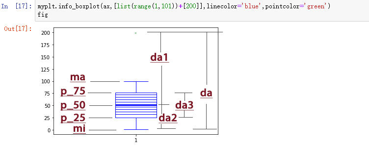
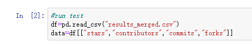
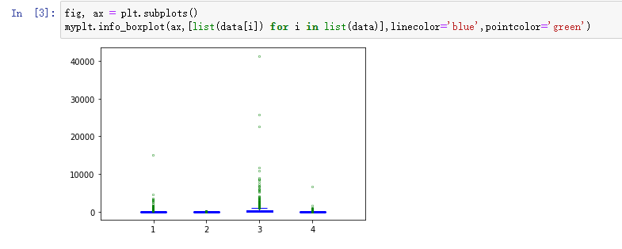
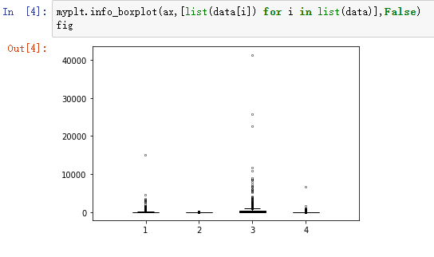
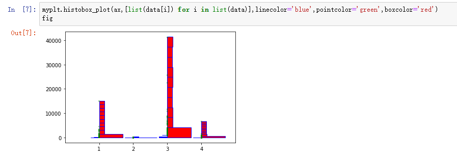
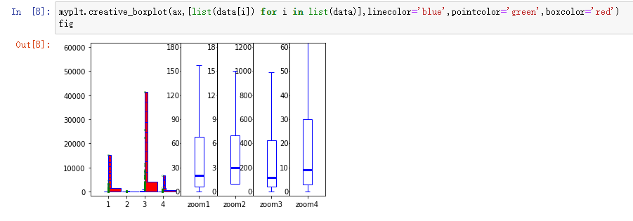

<font size="8">Code interpretation of myplt box diagram</font><br />

---

Group 47

Student(s)

+ Yichen Li, liyichen18@lzu.edu.cn
+ Yan Miao, miaoy2018@lzu.edu.cn

---

Myplt box diagram operation code explanation document and instruction

Introduction: the `myplt` class of boxplot can be roughly divided into three main code blocks, `info_boxplot()`, `histobox_plot()` and `creative_ boxplot()`. I will introduce it in four parts.

the package needed

```python
#!/usr/bin/python3
# -*- coding: UTF-8 -*-
import pandas as pd
import matplotlib.pyplot as plt
import numpy as np
```

---

# Table of Contents

[TOC]

~~Now we begin~~

---

# **Functional code interpretation**

The explanation of `cal_Quantile()`,`cal_max_min()`,`find_ex_point()`,`cul_all_max_min()` and `cul_step()` in the class `myplt`

## 1. cal_Quantile()

Source code of cal_Quantile

```python
#!/usr/bin/python3
# -*- coding: UTF-8 -*-
def cal_Quantile(da):
    if da.count()%2==0:
        p_50=(da[int(da.count()/2-0.5)]+da[int(da.count()/2)])/2
        da1=da[:int(da.count()/2)]
    else:
        p_50=da[int(da.count()/2)]
        da1=da[:int((da.count()+1)/2)]
    if da1.count()%2==0:
        p_75=(da1[int(da1.count()/2-0.5)]+da1[int(da1.count()/2)])/2
        da2=da[int(da.count()/2):]
    else:
        p_75=da1[int(da1.count()/2)]
        da2=da[int((da.count()+1)/2):]
    da2.reset_index(drop=True, inplace=True)
    if da2.count()%2==0:
        p_25=(da2[int(da2.count()/2-0.5)]+da2[int(da2.count()/2)])/2
    else:
        p_25=da2[int(da2.count()/2)]
    da3=da[int(da1.count()/2):(int(da2.count()/2)+int(da.count()/2))]
    da3.reset_index(drop=True, inplace=True)
    return (p_25,p_50,p_75,da3)
```

The input data is a single column series data `da` sorted by size.
The first if gets `P_50` according to the median rule, that is, the median (odd number takes the ((`da` number + 1) / 2) and even number takes item (`da` number / 2)).
Then bisection `da` to get the first half `da1`.
Taking `da1` as the total data set and taking the median rule again, so that `p_75` is obtained.
After that it continues to bisect `da` to get the second half of `da2`.
According to the same rules, `p_25` is obtained by taking `da2` as the total data set.
`da3` is the data set between `p_25` and `p_50`, which will be used later in calculating 5% (`cal_per5`) to draw complex graphs.
The function returns three int data `p_25`, `p_50` and `p_75`, the quartile, and a series data column `da_3`.

## 2. cal_max_min()

```python
def cal_max_min(da,p_25,p_75):
    ma=da[da<(p_25+(p_75-p_25)*1.5)].max()
    mi=da[da>(p_25-(p_75-p_25)*1.5)].min()
    return (ma,mi)
```

The input data is a single column series data `da` sorted by size, and 25% and 75% of the quartile,`p_25`,`p_75`.
The returned values are the maximum and minimum values within the reasonable range of the boxplot.
It is used to draw the upper and lower edges of the boxplot and calculate the outliers.

## 3. find_ex_point()

```python
def find_ex_point(data):
    da=pd.Series(data).astype(int)
    da=da.sort_values(ascending=False)
    da.reset_index(drop=True, inplace=True)
    p_25,p_50,p_75=myplt.cal_Quantile(da)[:3]
    da_ex=da[(da<(p_25-(p_75-p_25)*1.5)) | (da>(p_25+(p_75-p_25)*1.5))]
    return da_ex
```

The input data is single-layer list data, and the previous `cal_Quantile()` function will be called in the function body.
After calculation, a single column series data is returned, and the content is the abnormal value in the data,`da_ex`.

## 4. cul_all_max_min()

```python
def cul_all_max_min(data_l):
    data_l=[[int(i) for i in k] for k in data_l]
    return (max([max(i) for i in data_l]),min([min(i) for i in data_l]))
```

The input data is multi-layer list `data_ l`.
The first step is to convert all the data into int data, and then calculate the maximum and minimum values of all the data.
Return two int data, that is, the maximum and minimum of all data, and they will be used to set the common Y-axis coordinates in `creative_boxplot()`.

## 5. cul_step()

```python
def cul_step(da_ma,da_mi):
    n=(da_ma-da_mi)/4
    count=0
    while n>10:
        count+=1
        n/=10
    step=int(n)*10**count
    return step
```

The input data are the maximum value `da_ma` and the minimum value `da_mi` in the current data column da.
The return value is the appropriate `step` size for the y-axis interval.
Used to set the y-axis coordinates in `creative_boxplot()`.

---

# **Explanation and logical structure diagram of info_boxplot()**

## Source code of info_boxplot()

```python
def info_boxplot(ax,data_l,multiplebox=True,linecolor='black',pointcolor='black'):
    ax.cla()
    lenth=len(data_l)
    ax.set_xlim((0,lenth+1))
    tick_x=range(1,lenth+1)
    ax.set_xticks(tick_x)
    ax.set_xticklabels([str(i) for i in tick_x])
    def cal_per5(da3):
        per_5=[]
        add=da3.count()*0.1
        count=0
        for i in range(9):
            count+=add
            per_5.append(da3[int(count-1)])
        return per_5
    def draw_boxplot(ax,mi,ma,p_25,p_50,p_75,multiplebox,da_ex,per_5,k,linecolor='black',pointcolor='black'):
        ax.vlines(k,mi,p_25,color=linecolor,linewidth=1)
        ax.vlines(k,p_75,ma,color=linecolor,linewidth=1)
        ax.hlines(mi,k-0.15,k+0.15,color=linecolor,linewidth=1)
        ax.hlines(ma,k-0.15,k+0.15,color=linecolor,linewidth=1)
        rect = plt.Rectangle((k-0.25,p_25),0.5,p_75-p_25,linewidth=1, edgecolor=linecolor, facecolor='none')
        ax.add_patch(rect)
        #exception
        for i in da_ex.values:
            ax.text(k,i , "o",color=pointcolor, fontsize=5, verticalalignment="center",horizontalalignment='center')
            #ax.scatter(k,i,color='white', marker='o', edgecolors='black')
        ax.vlines(k,da_ex.min(),da_ex.max(),color='white',linewidth=1,zorder=0)
        if (not multiplebox):
            ax.hlines(p_50,k-0.25,k+0.25,color=linecolor,linewidth=1)
        else:
            #5%
            for i in per_5:
                ax.hlines(i,k-0.25,k+0.25,color=linecolor,linewidth=1)
            ax.hlines(p_50,k-0.25,k+0.25,color=linecolor,linewidth=3)
    def main_box(ax,data,multiplebox,k,linecolor,pointcolor):
        da=pd.Series(data).astype(int)
        da=da.sort_values(ascending=False)
        da.reset_index(drop=True, inplace=True)
        p_25,p_50,p_75,da3=myplt.cal_Quantile(da)
        per_5=cal_per5(da3)
        per_5[4]=p_50
        ma,mi=myplt.cal_max_min(da,p_25,p_75)
        da_ex=da[(da<(p_25-(p_75-p_25)*1.5)) | (da>(p_25+(p_75-p_25)*1.5))]
        draw_boxplot(ax,mi,ma,p_25,p_50,p_75,multiplebox,da_ex,per_5,k,linecolor,pointcolor)
    for k in range(lenth):
        main_box(ax,data_l[k],multiplebox,k+1,linecolor,pointcolor)
```

`before cal_per5`：Empty the canvas and set the x-axis ruler and label.

`cal_per5`：The input is the pandas interval `da3`, and the `da3` interval is equally divided into ten parts according to the number of numbers. The list type `per_5` records the nine dividing lines in the middle, which can also be understood as the y-axis scale that should be drawn. It is used to draw the 5% dividing line part of complex graph.

`draw_boxplot`：Input all kinds of parameters needed to draw the current box diagram, and the function is to draw a single box diagram. When `multiplebox` is `true`, nine more 5% boundaries are drawn to draw a complex box diagram.

`main_box`：The general manager to call various function functions. The input parameter (K+1) is the X-axis coordinate of the drawing line.

## Logical structure diagram of info_boxplot()

```flow
st=>start: Empty the canvas and set the X-axis
e=>end: Data input into draw_boxplot() for drawing
op1=>operation: The for loop makes every data entered into main_box() as a single-layer list data, and (k+1) is the x-axis scale
op2=>operation: The main_box() first converts list data into single column Series type data, and then calls corresponding functions after sorting
op3=>operation: Calculate the quartile int data p_25, p_50, p_75, series data da3,
5% list data per_5,
The maximum and minimum values of int data ma, mi in a reasonable interval,
Outlier series data da_ex

st->op1->op2->op3->e
```

## Logical structure diagram of draw_boxplot()

```flow
st=>start: Draw vertical lines from mi to p_25 and from p_75 to ma
e=>end: Finally, according to the multiplebox parameter, it can decide whether to draw only one median line or multiple lines according to the 5% scale
op1=>operation: Draw a horizontal line with y value equal to mi and a horizontal line with y = ma
op2=>operation: Draw the box in the middle part of the box
op3=>operation: According to the y-axis coordinates provided by the list type parameter da_ex, the method of text annotation is used to draw the abnormal value
Draw a white vertical line from the lowest point to the highest point of the outlier, and set the z-axis parameter to 0, so that the y-axis can cover the abnormal value displayed in the annotation form

st->op1->op2->op3->e
```

## Photo Annotate



---

# **Explanation and logical structure diagram of histobox_plot()**

## Source code of histobox_plot()

```python
def histobox_plot(ax, data_l,linecolor='black',pointcolor='black',boxcolor='lavender'):
    ax.cla()
    lenth=len(data_l)
    ax.set_xlim((0,lenth+1))
    tick_x=range(1,lenth+1)
    ax.set_xticks(tick_x)
    ax.set_xticklabels([str(i) for i in tick_x])
    def normal_his(da,Rec_begin):
        his_l=[]
        for i in range(len(Rec_begin)-1):
            his_l.append(da[(da<Rec_begin[i+1]) & (da>=Rec_begin[i])].count())
        his_l.append(da[da>=Rec_begin[len(Rec_begin)-1]].count())
        ma_l=max(his_l)
        mi_l=min(his_l)
        his_nor=[((i-mi_l)/(ma_l-mi_l))*0.55 for i in his_l]
        #标准化 [0,1]*0.55
        return his_nor
    def draw_histobox(ax,mi,ma,p_25,p_50,p_75,da_ex,Rec_begin,his_nor,da_m,da_n,k,linecolor='black',pointcolor='black',boxcolor='lavender'):
        ax.vlines(k,mi,ma,color=linecolor,linewidth=1)
        ax.hlines(mi,k-0.15,k,color=linecolor,linewidth=1)
        ax.hlines(ma,k-0.15,k,color=linecolor,linewidth=1)
        ax.hlines(p_50,k-0.25,k,color=linecolor,linewidth=1)
        rect = plt.Rectangle((k-0.25,p_25),0.25,p_75-p_25,linewidth=1, edgecolor=linecolor, facecolor='none')
        ax.add_patch(rect)
        for i in da_ex.values:
            ax.text(k,i , "o", fontsize=5,color=pointcolor, verticalalignment="center",horizontalalignment='center')
            #ax.scatter(k,i,color='white', marker='o', edgecolors='black')
        ax.vlines(k,da_ex.min(),da_ex.max(),color='white',linewidth=1,zorder=0)
        for i in range(len(Rec_begin)):
            rect = plt.Rectangle((k,Rec_begin[i]),0.15+his_nor[i],(da_m-da_n)/10,linewidth=1,edgecolor=linecolor, facecolor=boxcolor)
            ax.add_patch(rect)
    def main_box(ax,data,k,linecolor,pointcolor,boxcolor):
        da=pd.Series(data).astype(int)
        da=da.sort_values(ascending=False)
        da.reset_index(drop=True, inplace=True)
        p_25,p_50,p_75=myplt.cal_Quantile(da)[:3]
        ma,mi=myplt.cal_max_min(da,p_25,p_75)
        da_ex=da[(da<(p_25-(p_75-p_25)*1.5)) | (da>(p_25+(p_75-p_25)*1.5))]
        #这里改
        Rec_begin=np.arange(da.min(),da.max(),(da.max()-da.min())/10)
        his_nor=normal_his(da,Rec_begin)
        draw_histobox(ax,mi,ma,p_25,p_50,p_75,da_ex,Rec_begin,his_nor,da.max(),da.min(),k,linecolor,pointcolor,boxcolor)
    for k in range(lenth):
        main_box(ax,data_l[k],k+1,linecolor,pointcolor,boxcolor)
```

`Rec_begin`：Is list data. The content is the result of a single column of all data `da` divided into ten equal parts, starting from the minimum value.
The starting Y-axis coordinate used to draw the histogram interval.

`normal_his`：Input all data `da` and list data `Rec_begin`.
The function is to count the number of ten intervals divided by `Rec_begin`.
Get the `his_l` and standardize it to [0,0.55].
Get the standardized data list `his_nor` and return it.

`draw_histobox`：Draw according to the input parameters.

`main_box`：The general manager to call various function functions.

## Logical structure diagram of histobox_plot()

```flow
st=>start: Empty the canvas and set the X-axis
e=>end: Data input into draw_histobox() for drawing
op1=>operation: The for loop makes every data entered into main_box() as a single-layer list data, and (k+1) is the x-axis scale
op2=>operation: The main_box() first converts list data into single column Series type data, and then calls corresponding functions after sorting
op3=>operation: calculate the quartile int data type p_25, p_50, p_75, series data da3,
The maximum and minimum values of int data ma, mi in a reasonable interval,
Outlier series data da_ex,
The starting Y-axis coordinate recbegin and histogram square length his_nor of histogram interval

st->op1->op2->op3->e
```

## Logical structure diagram of draw_histobox()

```flow
st=>start: Draw a vertical line from mi to ma
e=>end: The his_nor overall + 0.15, making the data set in [0.15,0.7]
Draw
op1=>operation: Draw a horizontal line with y value equal to mi and a horizontal line with y = ma
op2=>operation: Draw the left half of the box diagram box
op3=>operation: According to the y-axis coordinates provided by the list type parameter da_ex, the method of text annotation is used to draw the abnormal value
Draw a white vertical line from the lowest point to the highest point of the outlier, and set the z-axis parameter to 0, so that the y-axis can cover the abnormal value displayed in the annotation form
op4=>operation: Draw the rectangle of histogram according to the bottom coordinate given by Rec_begin and the width coordinate given by his_nor.

st->op1->op2->op3->op4->e
```

---

# **Explanation and logical structure diagram of creative_boxplot()**

## Source code of creative_boxplot()

```python
def creative_boxplot(ax, data_l,linecolor='black',pointcolor='black',boxcolor='lavender'):
    ax.cla()
    lenth=len(data_l)
    ax.set_xlim((0,lenth*3+1))#lenth+lenth*2+1
    tick_x=range(1,lenth*3+1)
    his_x=list(tick_x)[:lenth]
    sim_x=[j for j in list(tick_x)[lenth:] if j%2==0]
    ax.set_xticks(his_x+sim_x)
    ax.set_xticklabels([str(i) for i in his_x]+["zoom"+str(i) for i in his_x])
    da_ma,da_mi=myplt.cul_all_max_min(data_l)
    step=myplt.cul_step(da_ma,da_mi)
    tick_y=list(range(da_mi-(da_mi%step),da_ma+step*2,step))
    ax.set_ylim((tick_y[0]-step/6,tick_y[-1]+step/6))
    ax.set_yticks(tick_y)
    ax.set_yticklabels([str(i) for i in tick_y])
    def normal_his(da,Rec_begin):
        his_l=[]
        for i in range(len(Rec_begin)-1):
            his_l.append(da[(da<Rec_begin[i+1]) & (da>=Rec_begin[i])].count())
        his_l.append(da[da>=Rec_begin[len(Rec_begin)-1]].count())
        ma_l=max(his_l)
        mi_l=min(his_l)
        his_nor=[((i-mi_l)/(ma_l-mi_l))*0.55 for i in his_l]
        #标准化 [0,1]*0.55
        return his_nor
    def draw_histobox(ax,mi,ma,p_25,p_50,p_75,da_ex,Rec_begin,his_nor,da_m,da_n,k,linecolor='black',pointcolor='black',boxcolor='lavender'):
        ax.vlines(k,mi,ma,color=linecolor,linewidth=1)
        ax.hlines(mi,k-0.15,k,color=linecolor,linewidth=1)
        ax.hlines(ma,k-0.15,k,color=linecolor,linewidth=1)
        ax.hlines(p_50,k-0.25,k,color=linecolor,linewidth=1)
        rect = plt.Rectangle((k-0.25,p_25),0.25,p_75-p_25,linewidth=1, edgecolor=linecolor, facecolor='none')
        ax.add_patch(rect)
        for i in da_ex.values:
            ax.text(k,i , "o", fontsize=5,color=pointcolor, verticalalignment="center",horizontalalignment='center')
            #ax.scatter(k,i,color='white', marker='o', edgecolors='black')
        ax.vlines(k,da_ex.min(),da_ex.max(),color='white',linewidth=1,zorder=0)
        for i in range(len(Rec_begin)):
            rect = plt.Rectangle((k,Rec_begin[i]),0.15+his_nor[i],(da_m-da_n)/10,linewidth=1,edgecolor=linecolor, facecolor=boxcolor)
            ax.add_patch(rect)
    def draw_y_axis(mi,ma,step,step1,lenth,tick_y,ratio,k):
        tick_y1=list(range(mi-(mi%step1),ma+step1*2,step1))
        while len(tick_y1)!=len(tick_y):
            if (len(tick_y1)<len(tick_y)):
                tick_y1.append(tick_y1[-1]+step1)
            else:
                tick_y1.pop()
        ax.vlines(lenth+2*k-1,(tick_y1[0]-step/6)*ratio,(tick_y1[-1]+step/6)*ratio,color='black',linewidth=1)
        for i in tick_y1:
            ax.hlines(i*ratio,lenth+2*k-1-0.05,lenth+2*k-1,color='black',linewidth=1)
            ax.text(lenth+2*k-1-0.05, i*ratio , str(i), fontsize=10, verticalalignment="center",horizontalalignment='right')
    def draw_sim_box(ax,mi,ma,p_25,p_50,p_75,ratio,k,lenth,linecolor='black'):
        ax.vlines(lenth+2*k,mi*ratio,p_25*ratio,color=linecolor,linewidth=1)
        ax.vlines(lenth+2*k,p_75*ratio,ma*ratio,color=linecolor,linewidth=1)
        ax.hlines(mi*ratio,lenth+2*k-0.15,lenth+2*k+0.15,color=linecolor,linewidth=1)
        ax.hlines(ma*ratio,lenth+2*k-0.15,lenth+2*k+0.15,color=linecolor,linewidth=1)
        rect = plt.Rectangle((lenth+2*k-0.25,p_25*ratio),0.5,(p_75-p_25)*ratio,linewidth=1, edgecolor=linecolor, facecolor='none')
        ax.add_patch(rect)
        ax.hlines(p_50*ratio,lenth+2*k-0.25,lenth+2*k+0.25,color=linecolor,linewidth=3)
    def main_box(ax,data,k,linecolor,pointcolor,boxcolor):
        da=pd.Series(data).astype(int)
        da=da.sort_values(ascending=False)
        da.reset_index(drop=True, inplace=True)
        p_25,p_50,p_75=myplt.cal_Quantile(da)[:3]
        ma,mi=myplt.cal_max_min(da,p_25,p_75)
        step1=myplt.cul_step(ma,mi)
        ratio=step/step1
        da_ex=da[(da<(p_25-(p_75-p_25)*1.5)) | (da>(p_25+(p_75-p_25)*1.5))]
        Rec_begin=np.arange(da.min(),da.max(),(da.max()-da.min())/10)
        his_nor=normal_his(da,Rec_begin)
        draw_histobox(ax,mi,ma,p_25,p_50,p_75,da_ex,Rec_begin,his_nor,da.max(),da.min(),k,linecolor,pointcolor,boxcolor)
        draw_y_axis(mi,ma,step,step1,lenth,tick_y,ratio,k)
        draw_sim_box(ax,mi,ma,p_25,p_50,p_75,ratio,k,lenth,linecolor)
    for k in range(lenth):
        main_box(ax,data_l[k],k+1,linecolor,pointcolor,boxcolor)
```

`normal_his`、`draw_histobox`：refer to the hisbox code to explain the content in the same location

`draw_y_axis`：scale the Y-axis of the enlarged view

`draw_sim_box`：draw the enlarged simple box diagram

`main_box`：the general manager to call various function functions

## Logical structure diagram of creative_boxplot()

```flow
st=>start: Empty the canvas and set the X-axis
e=>end: Data input into the draw_histobox() to draw the original image,
draw_y_axis() draws the y-axis coordinates of the enlarged drawing,
draw_sim_box() draws enlarged box diagram
op1=>operation: The maximum value da_ma and the minimum value da_mi of all layers are calculated
So that, it can calculate the step size. Sets the common Y-axis of all boxes
op2=>operation: The for loop makes each data entering main_box() as a single layer list data, The (k+1) is the X-axis scale
op3=>operation: main_box () first converts list data into single column Series data, and then calls corresponding functions after sorting
op4=>operation: The quartile int data type was calculated as p_25,p_50,p_75,and series data type da3,
the maximum and minimum values of int data type ma, mi in a reasonable interval,
The Y-axis of the enlarged drawing is step1,
Magnification ratio of enlarged and original drawings ratio,
Outlier series data da_ ex,
The starting Y-axis coordinate of histogram interval is Rec_begin and histogram grid length is his_nor

st->op1->op2->op3->op4->e
```

---

# Usage example

data enter

info_boxplot,True

info_boxplot,False

histobox_plot

creative_boxplot
